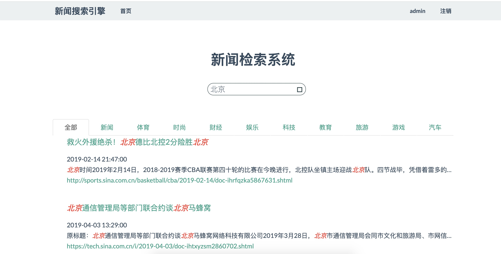

-----------------------------------
## 新闻搜索引擎
-----------------------------------
### 互联网访问地址
```
http://94.191.125.117:2019
```
### 项目文档


### 算法使用
```
搜索引擎功能： 倒排索引+BM25算法
针对每个新闻的推荐新闻： DOC2VEC相似度算法
```

#### 搜索引擎


#### 推荐新闻


## 代码介绍

```
----News_Search_Engine\
    |----db\                                :数据库的db文件
    |    |----ir.db
    |    |----ir.db-journal
    |----data\                              :爬取到的链接数据
    |    |----links.txt
    |----setup.py                           :一键构建项目
    |----images\                               
    |    |----recommend.jpg
    |    |----index.jpg
    |----app.py                             :服务器入口文件
    |----word2vec\                          :word2vec的模型文件
    |----search.py                          :服务器的检索功能
    |----config.py                          :配置参数
    |----static\                            
    |----templates\                         :前端模板
    |    |----Search.html
    |    |----News.html
    |    |----Index.html
    |----readme.md
    |----SinaSpyder\                        :爬虫,建索引,计算每条新闻的推荐
    |    |----bm25_config.py                :BM25的参数
    |    |----CreateBM25Index.py            :建索引
    |    |----SpyderLinksFromSina.py        :爬链接
    |    |----SpyderNewsInfomation.py       :爬详情
    |    |----CountRecommendNews.py         :计算推荐信息

```
### 联系作者
QQ：470581985

### 项目启动方式

##### 如果你是第一次启动本项目：

* 需要重新爬取新的链接，重新构建索引，重新计算推荐情况。
* step1:  运行`pip install -r requirement.txt` 安装项目环境
* step2： 运行 `setup.py` 会重新构建索引,计算推荐
* step3： 运行结束后,启动 `app.py` 即可启动项目


##### 如果你不是第一次启动本项目：

启动 `app.py` 即可启动项目